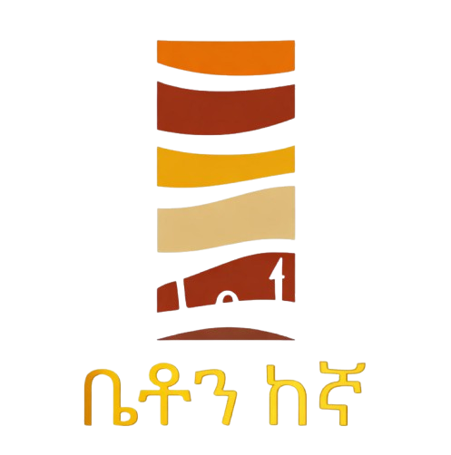

#  Beton Kegna - Real Estate Website

A modern, responsive website for Beton Kegna real estate sales, showcasing all types of homes and premium properties in Addis Ababa, Ethiopia.

## 🏢 About

Beton Kegna is a leading real estate sales company founded by Fanuel Kemeto, specializing in selling all types of homes including luxury apartments, villas, commercial properties, and residential homes in prime locations across Addis Ababa.

## ✨ Features

- **Bilingual Support** - English & Amharic
- **Responsive Design** - Mobile-first approach
- **Property Showcase** - Interactive galleries with 3D tours
- **Smart Filtering** - Filter properties by type
- **Dark/Light Theme** - User preference support
- **Contact Integration** - Multiple contact channels

## 🏗️ Projects

- **Gold Souq** - Commercial building at 4 Kilo
- **Ameliaz** - Luxury apartments in Sarbet
- **Ozone** - Modern living beside Sarem Hotel
- **Novelty** - Premium apartments at Friendship Park

## 🚀 Tech Stack

- **Framework:** Next.js 14
- **Styling:** Tailwind CSS
- **Language:** TypeScript
- **Deployment:** Vercel

## 📱 Contact

- **Website:** [betonkegna.com](https://betonkegna.com)
- **Email:** fanuelkemeto@gmail.com
- **Phone:** +251 930 879 595
- **Founder:** Fanuel Kemeto

## 📊 Stats

- 2+ years of experience
- 100+ happy clients
- 200M+ birr transactions

---

**ቤቶን ከእኛ** - Your trusted real estate sales partner in Ethiopia 🇪🇹